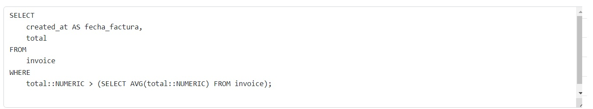

# TAS12 - View-projects
###### Javier Peña

## 1. El numero total de facturas realizadas por cada cliente: nombre_cliente | direccion | nro_facturas.
  - Sentencia:
  ```
SELECT
    c.full_name,
    c.address
FROM 
    client c
WHERE
    c.id IN (
        SELECT i.client_id
        FROM invoice i
        WHERE i.total > 100::MONEY
    );


  ```
  - Capturas:


## 2.Listar nombre y correo de los clientes junto a su compra mas cara realizada: nombres |  correo   | total_mas_alto.
  ```
SELECT 
    c.full_name AS nombre_cliente, 
    c.address AS direccion, 
    (SELECT COUNT(*) 
     FROM invoice i 
     WHERE i.client_id = c.id) AS nro_facturas
FROM 
    client c;
  ```
  - Capturas:


## 3. Listar las facturas donde sus totales sean mayores al promedio de las facturas: fecha_factura | total.
  - Sentencia:
  ```
SELECT
    created_at AS fecha_factura,
    total
FROM
    invoice
WHERE
    total::NUMERIC > (SELECT AVG(total::NUMERIC) FROM invoice);
  ```
  - Capturas:




## 4. Ejemplo con Subconsulta en el SELECT de la instancia Events.
  - Sentencia:
  ```
SELECT 
    e.nombre_evento, 
    (SELECT COUNT(*) FROM conferencias c WHERE c.id_evento = e.id_evento) AS numero_de_conferencias
FROM 
    eventos e;

  ```
  - Capturas:


## 5. Ejemplo con Subconsulta en el WHERE de Events.
  - Sentencia:
  ```
SELECT 
    m.nombre, 
    m.email 
FROM 
    miembros m
WHERE 
    m.id_miembro IN (
        SELECT 
            r.id_miembro 
        FROM 
            registros r 
        JOIN 
            conferencias c ON r.id_conferencia = c.id_conferencia 
        JOIN 
            eventos e ON c.id_evento = e.id_evento 
        WHERE 
            e.ciudad = 'Ciudad A'
    );


  ```
  - Capturas:


